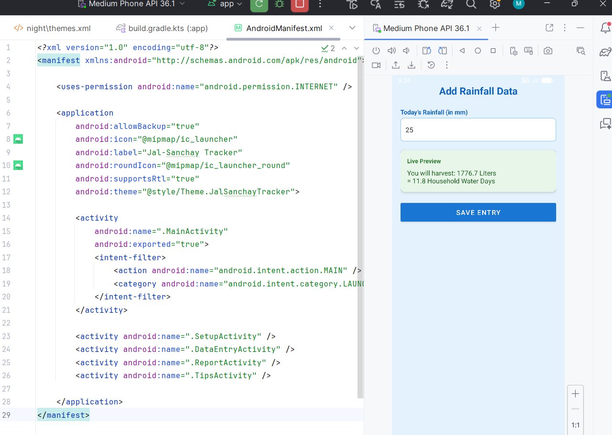
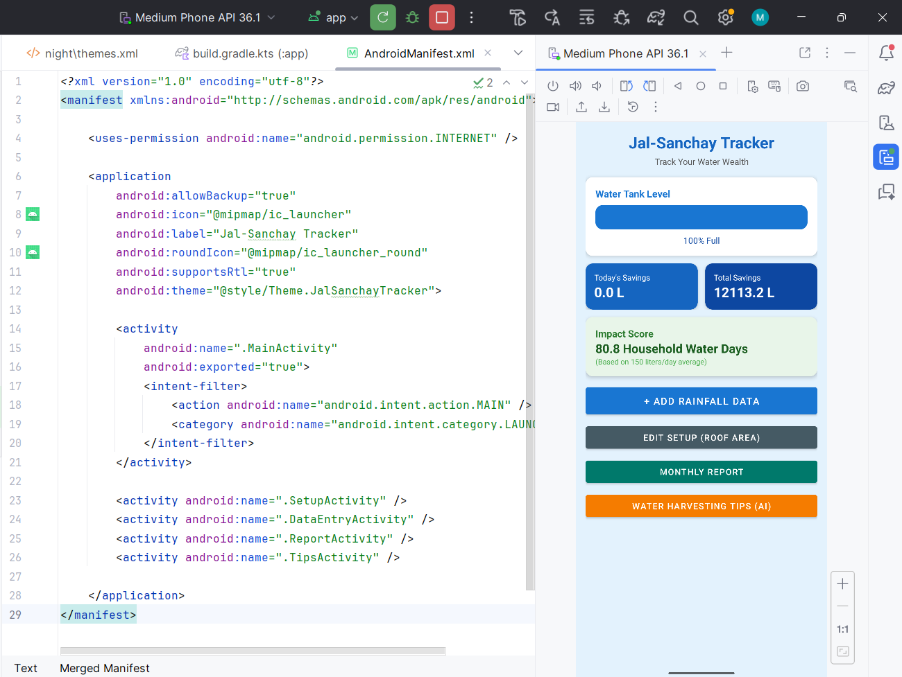
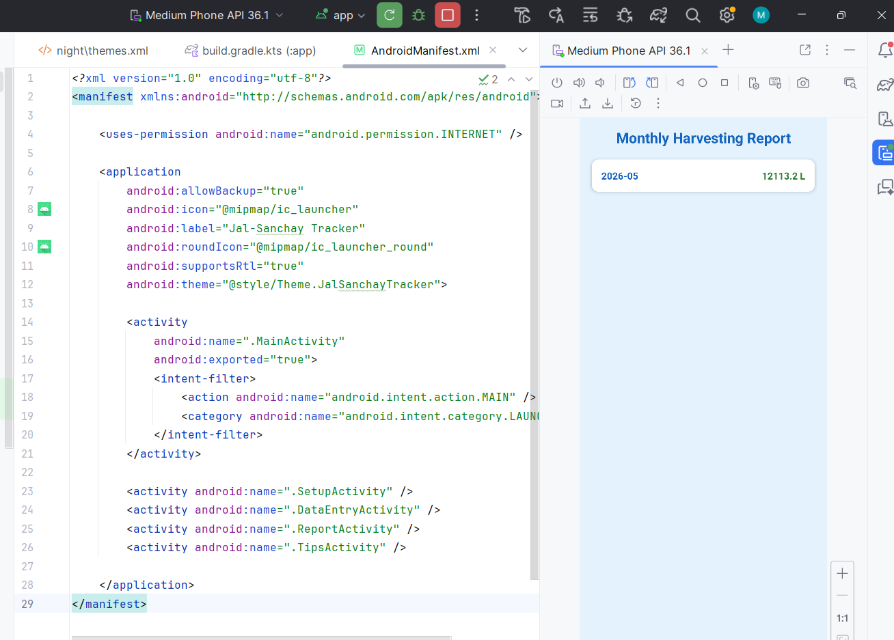

# Jal-Sanchay Tracker 💧

An Android app to track rainwater harvesting at home using GenAI.
Built for MindMatrix VTU Internship Program - Project Title 86.

## Problem Statement
Many households have rainwater harvesting systems but no way to 
track if they are effective. Without data, conservation feels intangible.

## Features
- Setup screen to enter roof area and tank capacity
- Manual rainfall data entry in mm
- Dashboard showing Liters Saved Today and Total Savings
- Water Tank visual progress bar that fills with data
- Impact Score converting liters to Household Water Days
- Monthly Report of total water saved
- AI-powered Water Harvesting Tips using Google Gemini API
- Input validation for non-numeric values

## Formula Used
Water Harvested (Liters) = Roof Area x Rainfall x 0.0929 x 0.85

## Tech Stack
- Language: Kotlin
- IDE: Android Studio
- Database: Room DB (SQLite)
- AI: Google Gemini API
- Architecture: MVVM (ViewModel + LiveData)
- Min SDK: API 24 (Android 7.0)

## How to Run
1. Clone the repository
2. Open in Android Studio
3. Add your Gemini API key in TipsActivity.kt
4. Run on Android device or emulator (API 24+)

## Screenshots

## Project Structure
- app/src/main/java - Kotlin source files
- app/src/main/res/layout - XML layout files
- app/src/main/res/drawable - Custom drawable files
